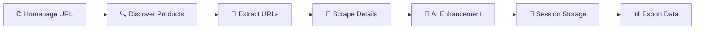

# 🛍️ MarketPlace Scraper Pro - Multi-Platform Product Discovery

<div align="center">

  
  
  
  

  <br/><br/>

  <h3>🛍️ Seamless Product Import Across Marketplaces 🛍️</h3>
  <p><i>Connect suppliers to marketplaces with AI-powered product discovery</i></p>

  <br/>

  [🚀 Quick Start](#-quick-start) • [📖 Documentation](#-documentation) • [🎯 Features](#-features) • [🤝 Contributing](#-contributing)

</div>

---

## 🛍️ Overview

**MarketPlace Scraper Pro** is a sophisticated multi-platform product discovery system that connects suppliers with marketplace platforms. Like a professional product sourcing agent, it efficiently discovers and imports products from various suppliers to populate your marketplace inventory.

### 🎯 Why MarketPlace Scraper Pro?

- **🛍️ Multi-Platform Support**: Works with WSmarketplace, JustSell, and other major platforms
- **🔗 Supplier Integration**: Multiple import methods ensure comprehensive product coverage
- **🤖 Smart Enhancement**: AI-powered product optimization and data completion
- **📊 Marketplace Focus**: Tailored specifically for marketplace operations and workflows
- **🔄 Seamless Import**: Direct integration with marketplace databases and inventory systems

---

## 🎯 Features

### 🛍️ Core Capabilities

#### 🔍 Phase 1: Product Discovery
```
🛒 Scan Suppliers → 🎯 Find Products → 🔗 Extract Links → 📋 Prepare Import
```
- Automatic product discovery from supplier catalogs
- Multi-supplier batch processing
- Intelligent product filtering and deduplication
- Real-time discovery visualization

#### 📦 Phase 2: Marketplace Import
```
🔍 Analyze → 📊 Extract → 🔄 Process → 🛍️ Import
```
- Comprehensive product information capture for marketplaces
- Multi-format compatibility (WSmarketplace, JustSell)
- AI-powered product enhancement and optimization
- Bulk marketplace operations support

### 🤖 AI Integration

<table>
  <tr>
    <td align="center">
      <h4>🧠 Groq AI</h4>
      <p>Marketplace descriptions</p>
    </td>
    <td align="center">
      <h4>🔮 Smart SKU</h4>
      <p>Product identifiers</p>
    </td>
    <td align="center">
      <h4>✨ Auto Enhancement</h4>
      <p>Product optimization</p>
    </td>
  </tr>
</table>

### 💾 Marketplace Management

- **🛍️ Multi-Platform**: Support for WSmarketplace and JustSell formats
- **🔄 Auto-Save**: Never lose product data with incremental saves
- **📊 Bulk Operations**: Apply changes across product batches
- **📤 Export Options**: Multiple marketplace formats (CSV, Excel, API Integration)

---

## 🚀 Quick Start

### 📋 Prerequisites

```bash
Python 3.9+ 🐍
Firecrawl API Key 🔥
Groq AI Key (optional) 🤖
```

### 1️⃣ Clone the Repository

```bash
git clone https://github.com/yourusername/marketplace-scraper-pro.git
cd marketplace-scraper-pro
```

### 2️⃣ Create Your Environment

```bash
# Windows
python -m venv venv
venv\Scripts\activate

# macOS/Linux
python3 -m venv venv
source venv/bin/activate
```

### 3️⃣ Install Dependencies

```bash
pip install -r requirements.txt
```

### 4️⃣ Configure API Keys

Create a `.env` file:
```env
FIRECRAWL_API_KEY=your_firecrawl_key
GROQ_API_KEY=your_groq_key  # Optional
```

### 5️⃣ Start the Platform!

```bash
python app.py
```

Navigate to `http://localhost:5000` 🛍️

---

## 📖 Documentation

### 🗺️ Quick Links

- 📚 **[User Guide](#-user-guide)** - Complete usage instructions below
- 🔧 **[API Configuration](#api-configuration)** - Setting up your API keys
- 🆘 **[Troubleshooting](#-troubleshooting)** - Common issues and solutions
- 🤝 **[FAQ](#-frequently-asked-questions)** - Frequently asked questions

### 🌊 Workflow Diagram



---

## 🛠️ Technology Stack

<div align="center">

| Layer | Technologies |
|-------|-------------|
| **🎨 Frontend** | HTML5, CSS3, JavaScript ES6+, SVG Graphics |
| **⚙️ Backend** | Python 3.9+, Flask 2.0+ |
| **🔍 Scraping** | Firecrawl API, BeautifulSoup4 |
| **🤖 AI** | Groq AI (Llama 3.1) |
| **💾 Storage** | LocalStorage, CSV, JSON |

</div>

---

## 🏗️ Project Structure

```
🛍️ MarketPlace-Scraper-Pro/
│
├── 🎯 app.py                    # Main Flask application
├── 📋 requirements.txt          # Python dependencies
├── 🔐 .env                      # Environment variables
│
├── 🌐 templates/
│   └── index.html               # Main interface
│
├── 🎨 static/
│   ├── css/
│   │   └── style.css           # Styling (3600+ lines)
│   └── js/
│       └── app.js              # Frontend logic (2000+ lines)
│
├── 🔧 ScraperFunctions/
│   ├── modules/
│   │   ├── scraper.py          # Core scraping logic
│   │   ├── product_scraper.py  # Product extraction
│   │   └── image_downloader.py # Image processing
│   └── data/
│       └── products.csv        # Extracted data
│
└── 📚 docs/
    ├── USER_GUIDE.md
    ├── API_REFERENCE.md
    └── TROUBLESHOOTING.md
```

---

## 🌊 API Endpoints

### Core Operations

| Endpoint | Method | Description |
|----------|--------|-------------|
| `/api/extract-urls` | POST | 🔍 Discover marketplace products |
| `/api/scrape-products` | POST | 📦 Import product details |
| `/api/job/{job_id}` | GET | 📊 Check operation status |
| `/api/validate-key` | POST | 🔐 Validate API keys |
| `/api/download-csv` | GET | 💾 Export scraped data |

---

## 🎨 Features Showcase

### 🌃 Dark Mode Interface
```
🌙 Comfortable night diving with full dark theme support
```

### 📊 Real-time Dashboard
```
📈 Live statistics • 🔄 Progress tracking • ⚡ Instant updates
```

### 🛡️ Data Validation
```
✅ API key verification • 🔒 Secure operations • 🎯 Error handling
```

---

## 📚 User Guide

### Getting Your API Keys

#### 🔥 Firecrawl API Key (Required)
1. Visit [Firecrawl.dev](https://www.firecrawl.dev)
2. Sign up for a free account
3. Navigate to API Keys in your dashboard
4. Copy your API key
5. Paste it in Settings → Firecrawl API Key

#### 🤖 Groq AI Key (Optional - for descriptions)
1. Visit [Groq Console](https://console.groq.com)
2. Create a free account
3. Go to API Keys section
4. Generate a new API key
5. Paste it in Settings → Groq API Key

### API Configuration

#### Settings Overview
- **Firecrawl API Key**: Required for all scraping operations
- **Groq API Key**: Only needed if Auto-Generate Description is enabled
- **Timeout**: How long to wait for each page (default: 30s)
- **Max Products**: Limit per scraping session (default: 50)
- **Auto-Generate SKU**: Creates unique product codes automatically
- **Auto-Generate Description**: Uses AI to write product descriptions

### Step-by-Step Scraping Guide

#### Phase 1: Discover Products
1. Enter supplier/store URLs (one per line)
2. Click "Initialize Discovery"
3. Wait for product discovery to complete
4. Review found products in the results box

#### Phase 2: Import Product Data
1. URLs auto-populate from Phase 1 (or paste your own)
2. Choose marketplace format (WSmarketplace/JustSell)
3. Click "Import Products"
4. Monitor progress with real-time updates
5. Products appear in the table below when complete

#### Phase 3: Review & Export
1. Click any cell in the table to edit
2. Use Quick Actions for bulk updates
3. Click "Finalize Session" to export
4. Choose your export format (WSmarketplace, JustSell, CSV, Excel)

---

## 🆘 Troubleshooting

### Common Issues & Solutions

#### "API Key Invalid" Error
- **Solution**: Check that you copied the entire key without spaces
- Ensure your Firecrawl account is active
- Try generating a new API key

#### "No Products Found"
- **Solution**: Verify the website structure is e-commerce
- Check if the site requires login/authentication
- Try with a different category page

#### SKU Not Generating
- **Solution**: Enable "Auto-Generate SKU" in Settings
- Make sure products have names
- Check browser console for errors

#### Progress Bar Stuck
- **Solution**: Check API Status indicator (should be green)
- Verify internet connection
- Refresh page and try again

#### Session Modal Clipping
- **Solution**: Already fixed! Clear browser cache if still occurring

---

## ❓ Frequently Asked Questions

### Q: How many products can I scrape?
**A:** Free Firecrawl tier allows ~500 pages/month. Each product = 1 page.

### Q: Can I scrape any website?
**A:** Works best with standard supplier sites and e-commerce stores (Shopify, WooCommerce, etc.). Some sites with heavy anti-scraping measures may not work.

### Q: Why use Groq AI instead of OpenAI?
**A:** Groq is faster and free for moderate usage. You can modify the code to use OpenAI if preferred.

### Q: Can I resume a failed scraping session?
**A:** Yes! Enable "Auto-save progress" in Settings. Your session is saved every 10 products.

### Q: What's the best export format?
**A:**
- **WSmarketplace**: Professional marketplace format with wholesale features
- **JustSell**: Streamlined marketplace format for direct sales
- **CSV**: Universal, works with any platform
- **Excel**: Good for manual editing and analysis

### Q: How do I import from multiple suppliers?
**A:** Run separate sessions for each supplier, then combine results using Session Management or merge CSV files.

---

## 🤝 Contributing

We welcome all divers to contribute to our ocean of code! See [CONTRIBUTING.md](CONTRIBUTING.md) for guidelines.

### 🔧 Development Setup

```bash
# Install development dependencies
pip install -r requirements-dev.txt

# Run tests
pytest tests/

# Format code
black .
flake8 .
```

---

## 📞 Support & Contact

### 🆘 Get Help

- 📧 **Email**: support@marketplace-scraper.pro
- 💬 **Discord**: [Join our Marketplace Community](https://discord.gg/marketplace-scraper)
- 🐛 **Issues**: [GitHub Issues](https://github.com/yourusername/marketplace-scraper-pro/issues)
- 📚 **Wiki**: [Documentation Wiki](https://github.com/yourusername/marketplace-scraper-pro/wiki)

### 🌟 Star History

[](https://star-history.com/#yourusername/marketplace-scraper-pro&Date)

---

## 📄 License

This project is licensed under the MIT License - see the [LICENSE](LICENSE) file for details.

---

## 🙏 Acknowledgments

<div align="center">

Special thanks to our technology partners:

**🔥 Firecrawl** • **🤖 Groq AI** • **🌊 Open Source Community**

</div>

---

<div align="center">
  <br/>
  <h3>🛍️ Built for Marketplace Success 🛍️</h3>
  <p><i>Connecting suppliers to marketplaces with intelligent automation</i></p>
  <br/>
  <p>© 2025 MarketPlace Scraper Pro • All Rights Reserved</p>
  <br/>

  Made with 💙 and ☕ by the MarketPlace Scraper Team

  <br/><br/>

  [⬆️ Back to Top](#-marketplace-scraper-pro---multi-platform-product-discovery)
</div>